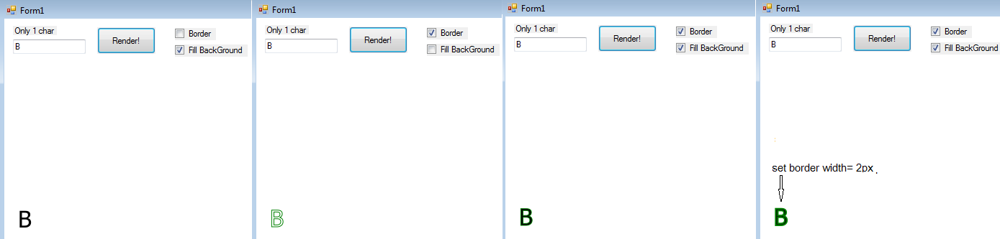

PixelFarm's FontRasterizer
===========

Simple and clean TrueType font renderer written purely in c#.

 * 1.Loads .ttf files, with OpenTypeReader (former NRasterizer,https://github.com/vidstige/NRasterizer)
 
 * 2.Rasterizes char to bitmap with pure software renderer + Agg(anti grain geometry) Quality! with 
      our PixelFarm's MiniAgg :) (https://github.com/LayoutFarm/PixelFarm)
	  
 * .Net >=2.0 
 
License
-----------
Apache2, 2014-2016, Samuel Carlsson, WinterDev

Screenshots
-----------
Some screenshots of the current master.

 