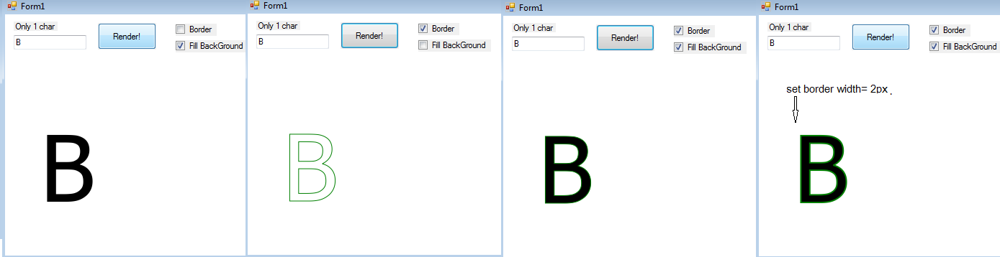

===========

Pure C# TrueType/OpenType/OpenFont Reader, Glyph Layout and Rendering.
---

During developing the [PixelFarm](https://github.com/PaintLab/PixelFarm),
I think _'How-to-render-a-font-glyph'_ may be useful for other libs.

So, I spin off  _'How-to-render-a-font-glyph'_ part to here,the **Typography**.

The Typography lib dose NOT NEED PixelFarm Rendering lib.

_pic 1:  Typography project's Solution Explorer View_

see pic1, I provide the example(1) that uses Typography with WinGdiPlus,

and the example(2) the uses Typography with 'mini' snapshot of PixelFarm Rendering Lib(3). 

Concept
---

 * 1.Loads .ttf files, with OpenFontReader.
 
 * 2.Rasterizes char to bitmap with pure software renderer + Agg(anti grain geometry) Quality! with 
      our PixelFarm's MiniAgg :) (https://github.com/PaintLab/PixelFarm)
	  
 * .Net >=2.0 

 
License
-----------

Apache2, 2016-2017, WinterDev

Apache2, 2014-2016, Samuel Carlsson, Big thanks for https://github.com/vidstige/NRasterizer

MIT, 2015, Michael Popoloski, from https://github.com/MikePopoloski/SharpFont

The FreeType Project LICENSE (3-clauses BSD),2003-2016, David Turner, Robert Wilhelm, and Werner Lemberg. from https://www.freetype.org/

BSD, 2009-2010, Poly2Tri Contributors, from https://github.com/PaintLab/poly2tri-cs

BSD, 2002-2005, Maxim Shemanarev, Anti-Grain Geometry - Version 2.4 from http://www.antigrain.com

BSD, 2007-2014, Lars Brubaker, agg-sharp, from  https://github.com/MatterHackers/agg-sharp 

MIT, 2016, Viktor Chlumsky, from https://github.com/Chlumsky/msdfgen

Screenshots
-----------
Some screenshots of the current master.

 

---

Enable TrueType Hinting, Tahoma , 8 pts

---
Tahoma, 72 pts (disable TrueType Hinting)

---
Tahoma, 8 pts, (disable TrueType Hinting)

---
Tahoma, 11 pts (disable TrueType Hinting)

---
Enable Kerning

---
SubPixel Rendering
 

---
Multi-channel signed distance field (Msdf) Texture (https://github.com/Chlumsky/msdfgen) 

---
Msdf Texture

---
**Advance OpenFont Text Shaping**

**1. GSUB :  ligature feature** 
 

_pic 1: show GSUB's  glyph ligature, see f-i_

---

**2. GPOS**
 
 

_pic 2: test with Thai (complex script) glyph that require gpos table_
 
---
**3. GSUB** : ccmp
 

_pic 3: test with Thai glyph (complex script) , shows glyph substitution_

--- 

**4. GSUB -  GPOS** 

 
 

_pic 4: test with Thai glyph (complex script)_

